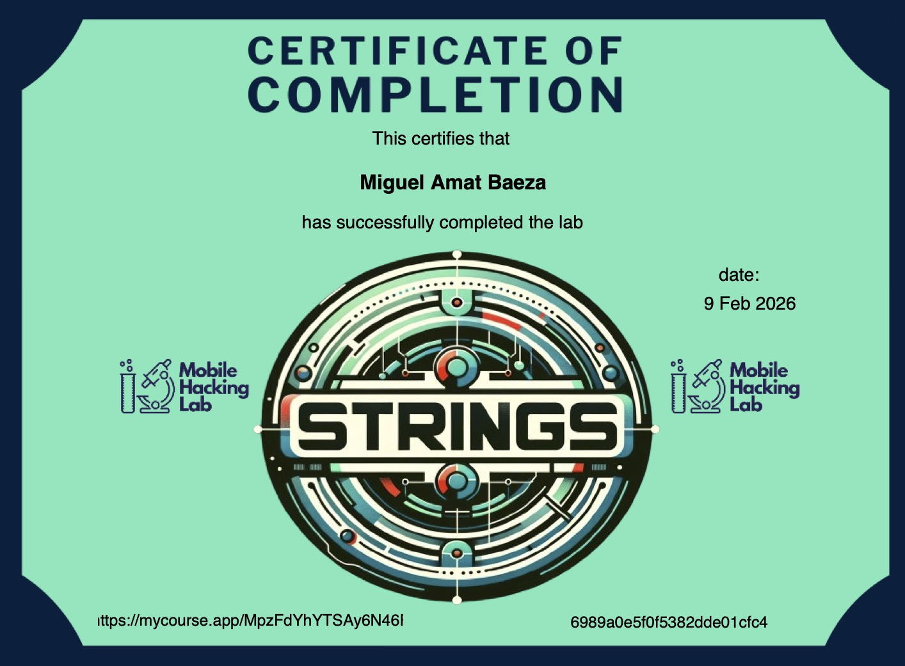
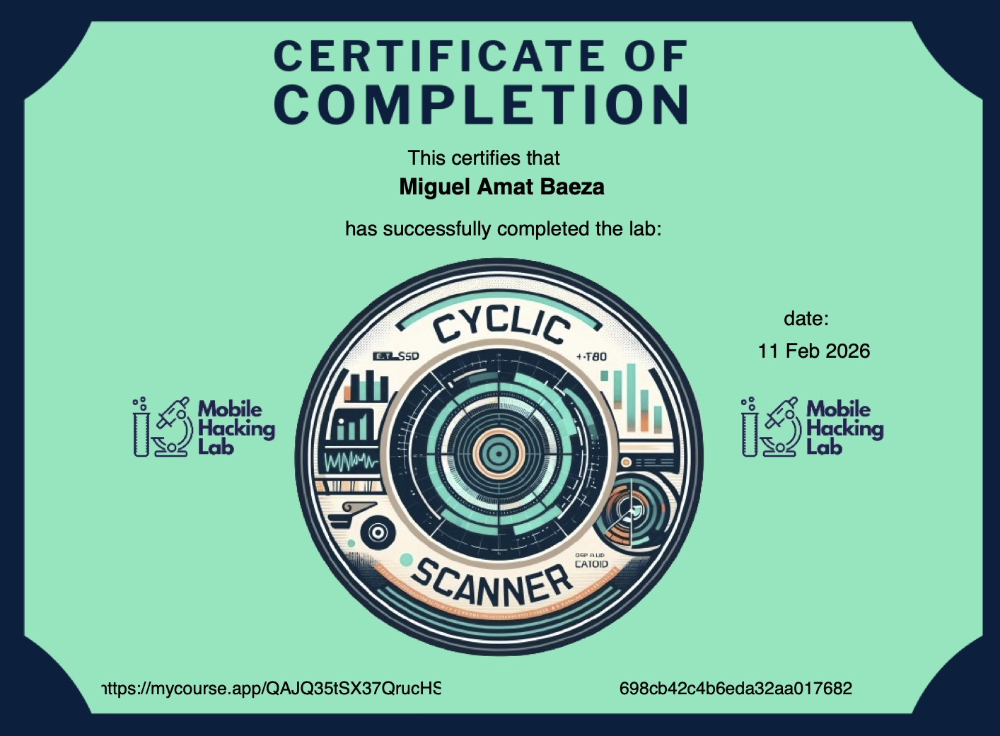
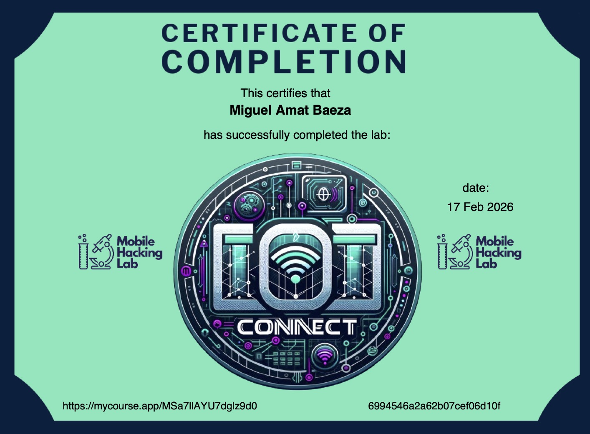
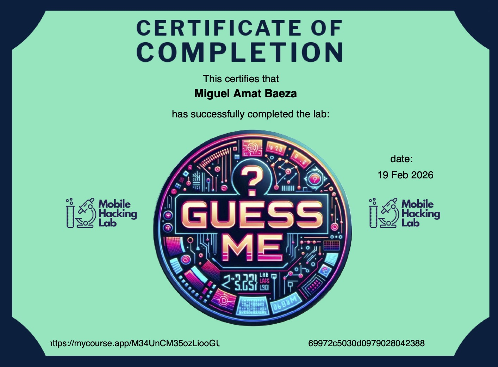
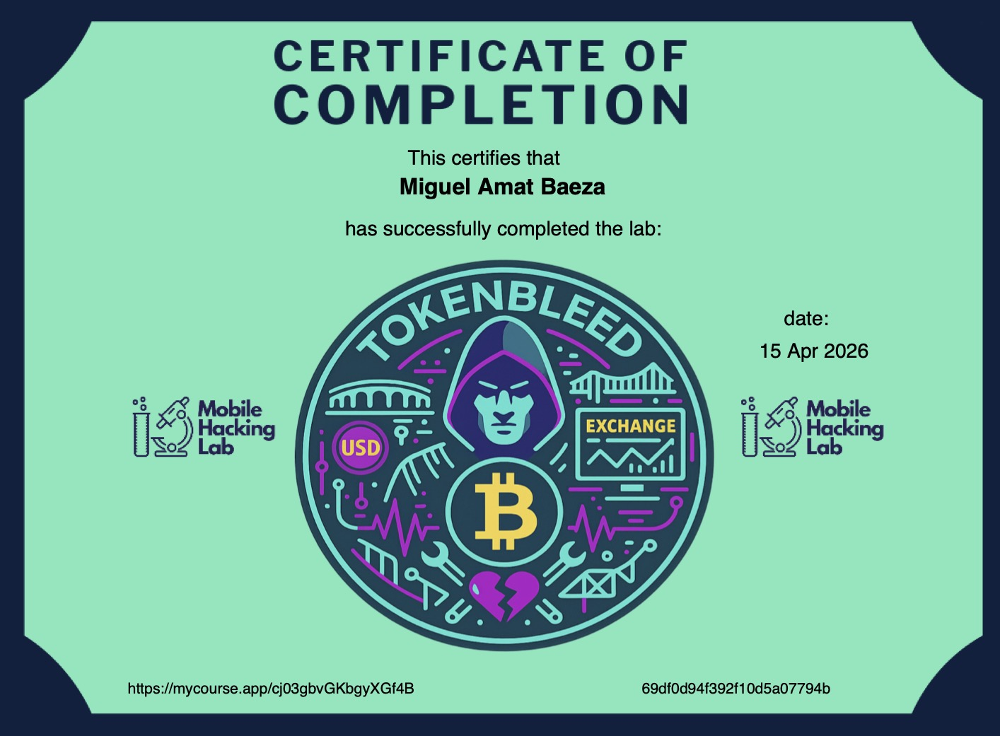
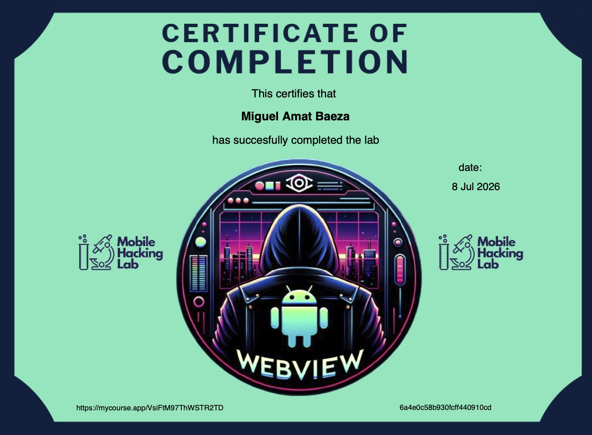
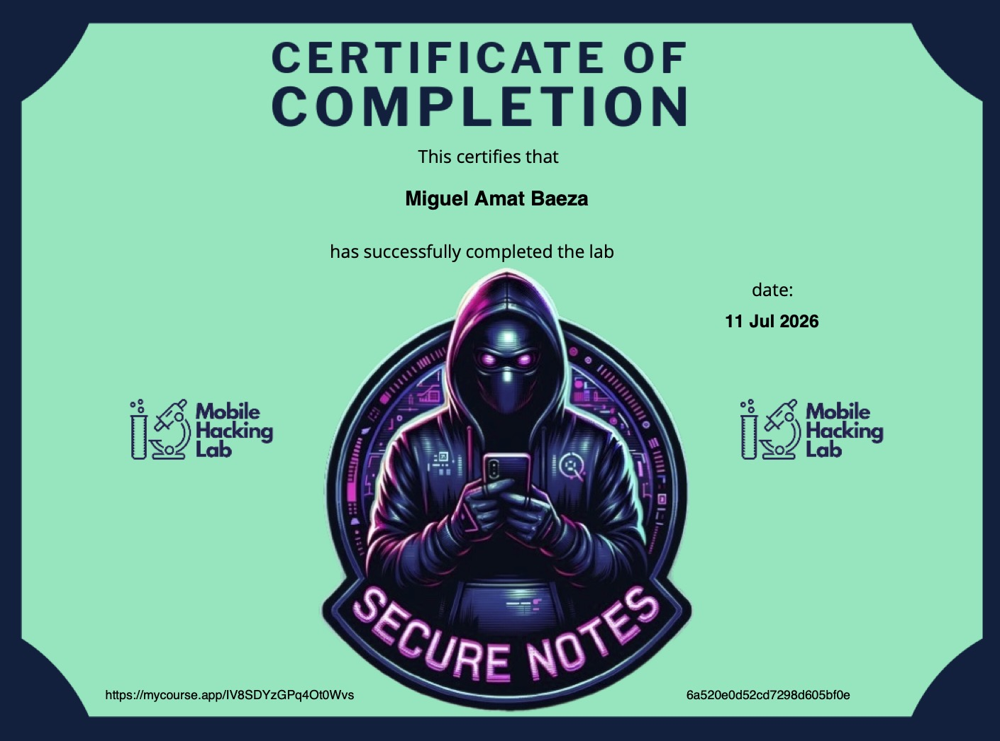
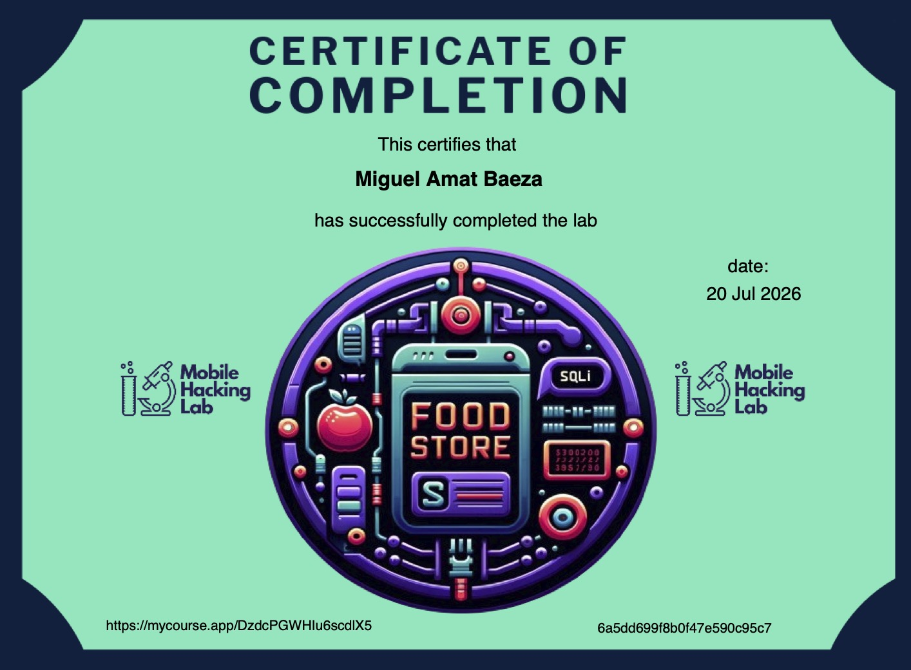

# MobileHackingLabs
Mobile Hacking Lab offers a range of [challenges](https://academy.mobilehackinglab.com/free-mobile-hacking-labs) on virtual Android and iOS devices.

|||||
:--: | :--: | :--: | :--:
[Strings](https://academy.mobilehackinglab.com/course/lab-strings) | [Cyclic Scanner](https://academy.mobilehackinglab.com/course/lab-cyclic-scanner) | [IOT Connect](https://academy.mobilehackinglab.com/course/lab-iot-connect) | [Guess Me](https://academy.mobilehackinglab.com/course/lab-guess-me)
 |  |  | 
[TokenBleed](https://academy.mobilehackinglab.com/course/lab-tokenbleed) | [Post Board](https://academy.mobilehackinglab.com/course/lab-postboard) | [Secure Notes](https://academy.mobilehackinglab.com/course/lab-secure-notes) | [Food Store](https://academy.mobilehackinglab.com/course/lab-food-store)
 |  |  | 

